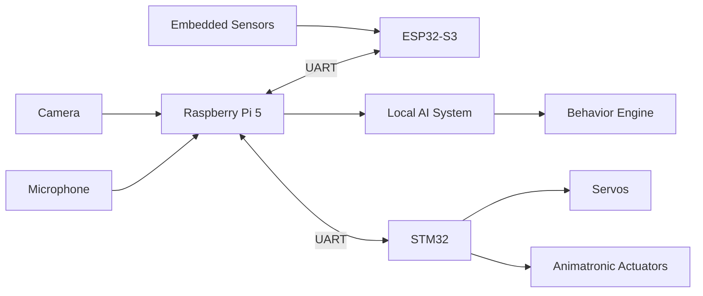

<div align="center">
  

  <h1>E.L.B.E.R.R.</h1>

  <p>
    A fanmade animatronic robot powered by local AI, embedded control systems,
    and custom hardware.
  </p>

  <p>
    <a href="https://github.com/0Zane/E.L.B.E.R.R./stargazers">
      
    </a>
    <a href="https://github.com/0Zane/E.L.B.E.R.R./issues">
      
    </a>
    
    
    
    
  </p>
</div>

---

## Overview

**E.L.B.E.R.R.** is a fanmade animatronic project inspired by the robot featured
in the animations from [LIGHTS ARE OFF](https://www.youtube.com/@LIGHTSAREOFF).

The goal of this project is to recreate the character as a physical animatronic
robot using a custom local AI system, embedded motor control, sensors, and
purpose-built hardware. E.L.B.E.R.R. is designed as a self-contained robot that
can process information locally, control its own actuators, and respond through
real-time embedded systems.

> This is an unofficial fan project. It is not affiliated with, endorsed by, or
> produced by LIGHTS ARE OFF.

<div align="center">
  
  <br />
  <sub>Reference image of the robot from the original animation.</sub>
</div>

---
# Architecture Changes

## Core Concept

E.L.B.E.R.R. is built around a three-processor architecture:

* A **Raspberry Pi 5** acts as the primary computer, running the local AI system, behavior engine, perception, and overall robot coordination.
* An **ESP32-S3** serves as the communication and sensing processor, handling environmental sensors, wireless connectivity, and RF communication.
* An **STM32** microcontroller is dedicated to real-time servo and actuator control, ensuring smooth, deterministic motion and reliable animatronic performance.

This separation allows each processor to focus on a specific task while keeping motion control isolated from higher-level software.

The Raspberry Pi 5, ESP32-S3, and STM32 communicate with one another over UART.



---

## Hardware Architecture

| Subsystem              | Component                                        | Purpose                                                                                     |
| ---------------------- | ------------------------------------------------ | ------------------------------------------------------------------------------------------- |
| Main computer          | Raspberry Pi 5                                   | Local AI, behavior logic, planning, vision processing, networking, and system orchestration |
| Sensor & RF controller | ESP32-S3                                         | Environmental sensors, wireless communication, RF capabilities, and data collection         |
| Motion controller      | STM32                                            | Real-time servo control, actuator control, deterministic timing, and motion safety          |
| Mechanical system      | Animatronic frame                                | Physical movement, expression, and character presence                                       |
| Sensors                | Cameras, microphones, IMUs, and embedded sensors | Environmental input and interaction data                                                    |
| PCB design             | KiCad                                            | Custom circuit design, wiring organization, and hardware integration                        |
| Firmware               | C++                                              | Embedded software for STM32 and ESP32-S3                                                    |

---

## Raspberry Pi 5

The Raspberry Pi 5 is the central computer of E.L.B.E.R.R.

Its responsibilities include:

* Running the local AI system
* Managing high-level robot behavior
* Processing camera, microphone, and perception data
* Coordinating communication between all processors
* Handling networking, logging, and debugging
* Making behavioral decisions before sending motion commands to the STM32

The Pi is responsible for what the robot **thinks**.

---

## ESP32-S3

The ESP32-S3 is dedicated to sensing and wireless communication.

Its responsibilities include:

* Reading environmental sensors
* Monitoring digital and analog inputs
* Handling RF and wireless communication
* Forwarding sensor information to the Raspberry Pi 5
* Providing low-power peripheral management

The ESP32-S3 is responsible for what the robot **perceives** and how it communicates with external devices.

---

## STM32

The STM32 is dedicated to real-time motion control.

Its responsibilities include:

* Driving servos and animatronic actuators
* Generating precise PWM outputs
* Executing smooth motion profiles
* Enforcing movement limits
* Monitoring actuator timing
* Executing commands received from the Raspberry Pi 5

The STM32 is responsible for how the robot **moves**.

---

## Project Structure

```text
E.L.B.E.R.R./
|-- software/
|   |-- ai.py
|   |-- boot.py
|   |-- llm.py
|   |-- main.py
|   |-- memory/
|   |-- Modelfile
|   |-- README.md
|   |-- requirements.txt
|   |-- stt.py
|   `-- tts.py
|-- esp32-firmware/
|   |-- include/
|   |-- lib/
|   |-- src/
|   |-- test/
|   `-- platformio.ini
|-- stm32-firmware/
|   `-- stm/
|       |-- Core/
|       |-- Drivers/
|       |-- Startup/
|       `-- stm.ioc
|-- hardware/
|   |-- esp/
|   |-- eyes/
|   |-- stm/
|   `-- README.md
|-- index.html
|-- elberr.jpg
|-- elberr.png
|-- README.md
`-- LICENSE
```

---

## Technologies

| Area              | Technology                  |
| ----------------- | --------------------------- |
| Main compute      | Raspberry Pi 5              |
| Sensor processor  | ESP32-S3                    |
| Motion controller | STM32                       |
| Firmware          | C++                         |
| PCB design        | KiCad                       |
| 3D modeling       | Fusion 360                  |
| AI                | Local custom AI system      |
| Architecture      | Distributed embedded system |

---

## Inspiration

This project is inspired by the robot created in the animations from
[LIGHTS ARE OFF](https://www.youtube.com/@LIGHTSAREOFF).

E.L.B.E.R.R. is a fanmade physical interpretation of that concept, built as a
personal robotics, AI, and embedded systems project.

---

## License

This project is licensed under the **MIT License**.

See the [LICENSE](./LICENSE) file for details.
